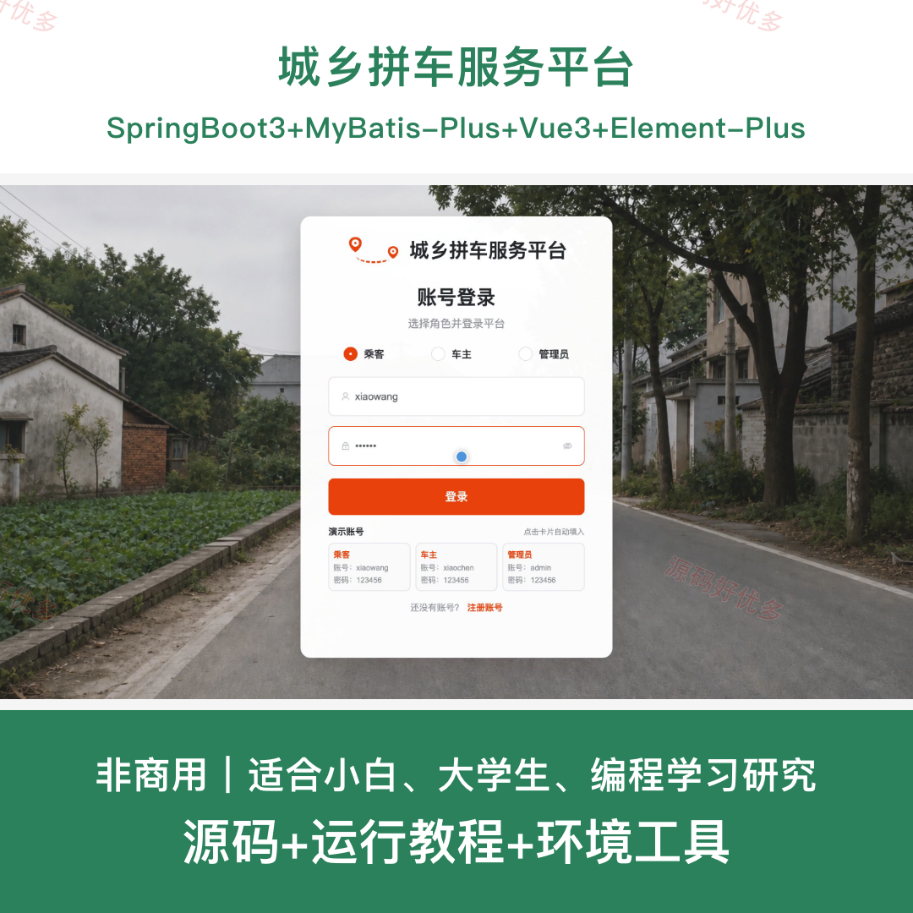
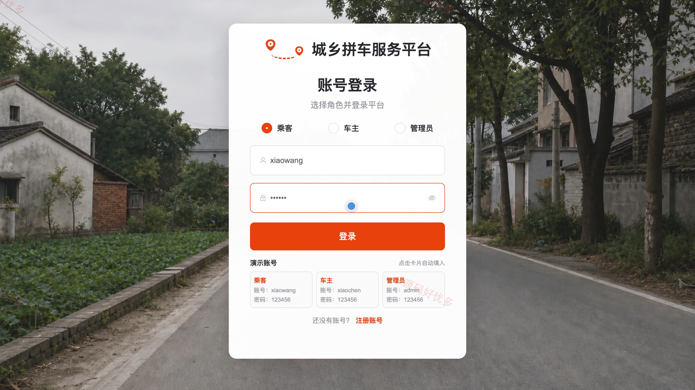
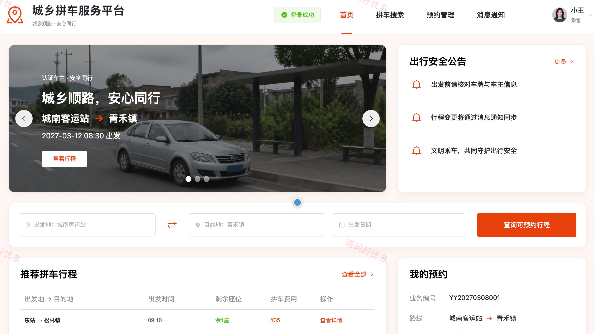
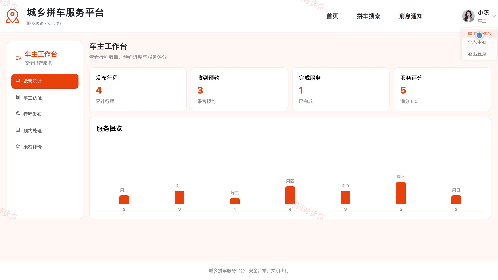
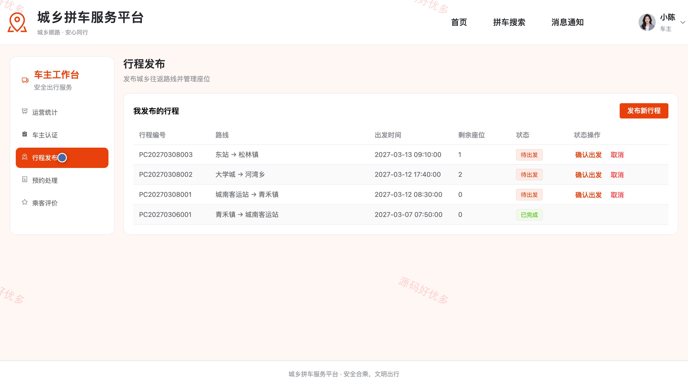
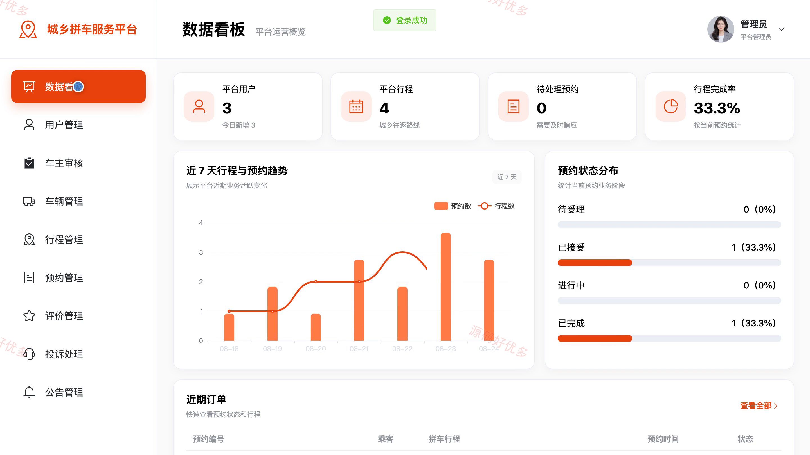
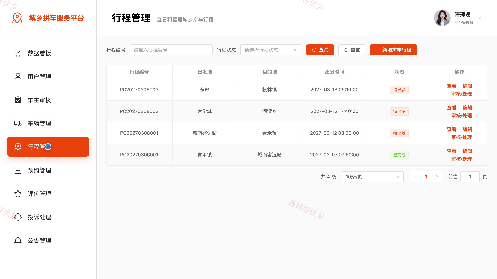
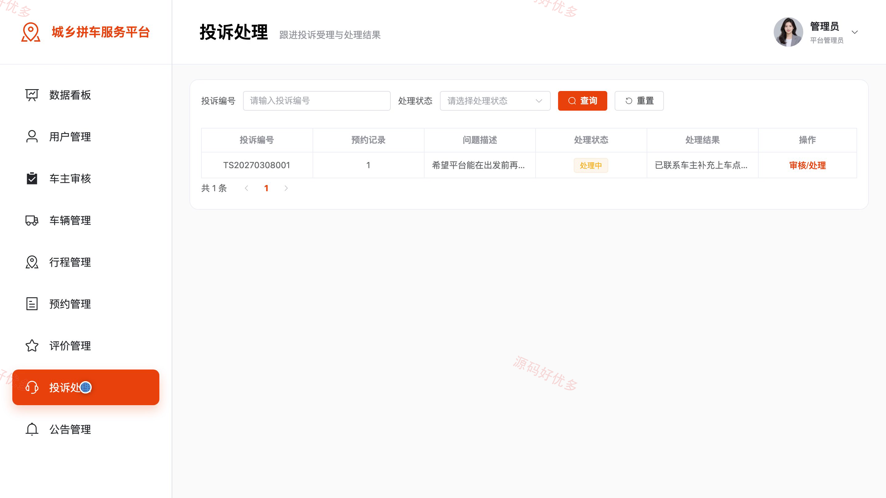

# bs064A
bs064A城乡拼车服务平台
## 源码问题查看主页咨询

### 一、关键词
城乡拼车、顺风车、合乘出行、车主接单、出行预约

### 二、作品包含
源码+数据库+万字设计文档+PPT+全套环境和工具资源+本地部署教程

### 三、项目技术
前端技术： Html、Css、Js、Vue3.4、Element-Plus
后端技术：Java、SpringBoot3.2.0、MyBatis-Plus

### 四、运行环境（以下版本亲测，其他版本兼容性请自行测试）
开发工具：IDEA/eclipse + VSCODE

数据库：MySQL5.7+（共13张表）

数据库管理工具：Navicat10以上版本

环境配置软件： JDK17 + Maven3.6.3

前端Nodejs：20

浏览器：谷歌浏览器

### 五、项目介绍
项目编号：bs064A

平台面向城乡之间的合乘出行需求，提供拼车行程搜索、预约与评价，支持车主认证、行程发布、预约处理和状态跟踪，并为管理员提供用户、车辆、行程、投诉和公告管理。

角色：乘客、车主、管理员

乘客功能：注册登录、拼车搜索与行程详情、拼车预约、预约管理与取消、行程评价、消息通知、投诉反馈、个人资料与密码。

车主功能：注册登录、车主认证、行程发布管理及状态更新、预约处理与乘客名单、接单统计、乘客评价查看、消息通知、个人资料与密码。

管理员功能：乘客和车主账号管理、车主认证审核、车辆管理、行程与预约管理、评价管理、投诉处理、公告管理、数据统计。

### 六、运行截图

